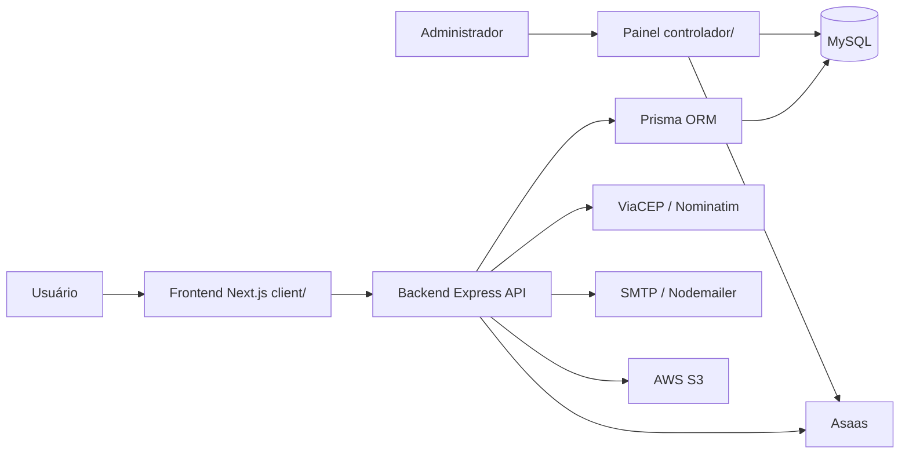
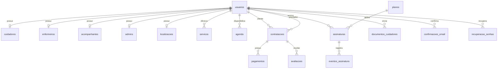

# Relatório Técnico do Projeto Nosso Zelo

## 1. Objetivo do relatório

Este relatório documenta a análise técnica do repositório `ChacaraKairo/NossoZelo_MKT`, referente ao projeto Nosso Zelo. O documento tem finalidade acadêmica e serve como apoio ao Capítulo III da monografia, especialmente nas seções de desenvolvimento do aplicativo, implementação, avaliação técnica e análise dos testes realizados. A análise considera exclusivamente código-fonte, documentação, arquitetura, scripts, testes e resultados técnicos. Planilhas Excel e dados de formulário existentes no repositório não foram analisados.

## 2. Visão geral do projeto

O Nosso Zelo é uma plataforma web voltada à intermediação da contratação de cuidadores, enfermeiros e acompanhantes. A proposta do sistema é conectar famílias e pessoas que necessitam de cuidado domiciliar a profissionais cadastrados, com recursos de busca, perfil profissional, geolocalização, solicitação de atendimento, avaliações, documentação, autenticação e assinatura de prestadores.

No estado analisado, o repositório demonstra um MVP funcional, com separação entre frontend público, backend API e painel administrativo. O sistema combina tecnologias modernas de desenvolvimento web com banco relacional e ORM, buscando viabilizar fluxos essenciais de um marketplace de serviços de cuidado.

## 3. Estrutura do repositório

| Caminho | Finalidade | Principais tecnologias ou responsabilidades |
| --- | --- | --- |
| `client/` | Aplicação web pública e área autenticada de usuários/prestadores. | Next.js Pages Router, React, TypeScript, Axios, Zustand, CSS Modules. |
| `server/` | API principal do sistema. | Node.js, Express, TypeScript, Prisma, MySQL, JWT, cookie HttpOnly, Vitest, Supertest. |
| `controlador/` | Painel administrativo separado. | Next.js App Router, TypeScript, Prisma, Zod, autenticação administrativa, APIs internas. |
| `server/prisma/` | Schema, migrations e seed do backend. | Prisma ORM, migrations SQL para MySQL. |
| `controlador/prisma/` | Schema e migrations usados pelo painel administrativo. | Prisma ORM alinhado às entidades administrativas. |
| `docs/` | Documentação técnica e operacional existente. | Arquitetura, API, produção, segurança, operação, fluxos e checklist de MVP. |
| `data_base/` | Documentação auxiliar sobre banco e Docker. | Notas de banco de dados. |
| `docker-compose.yml` | Ambiente local integrado. | MySQL 8.4, backend, frontend, volumes e healthcheck. |
| `.github/` | Configurações de automação do repositório. | Workflows e metadados de GitHub. |

Observa-se que `server/src/src` é uma estrutura herdada mantida no projeto; a própria documentação do repositório recomenda refatoração futura, mas preserva o padrão atual para reduzir risco de quebra.

## 4. Arquitetura da aplicação

A arquitetura segue o modelo cliente-servidor. O `client/` atua como frontend público, consumindo a API Express por meio de Axios com `withCredentials`. O `server/` concentra regras de negócio, autenticação, autorização, validações, integração com banco e gateways externos. O banco principal é MySQL, acessado via Prisma ORM. O `controlador/` funciona como painel administrativo separado, também em Next.js e Prisma, com rotas administrativas próprias para usuários, prestadores, planos, assinaturas, e-mail, pendências, logs e relatórios.

Integrações externas aparecem implementadas ou preparadas no código: ViaCEP e Nominatim para geocodificação, SMTP/Nodemailer para e-mails, AWS S3 para armazenamento de fotos/documentos e Asaas para assinatura/pagamento de prestadores. Em infraestrutura local, o `docker-compose.yml` prevê MySQL, backend e frontend. Para produção, a documentação recomenda banco gerenciado, HTTPS, storage S3, Redis/Upstash para rate limit distribuído, ClamAV para uploads e gateway Asaas em ambiente produtivo.

## 5. Tecnologias utilizadas

| Camada | Tecnologia | Finalidade no projeto |
| --- | --- | --- |
| Frontend | Next.js 16 | Renderização e roteamento da aplicação web. |
| Frontend | React 19 | Construção de interfaces. |
| Frontend | TypeScript | Tipagem estática. |
| Frontend | Axios | Cliente HTTP para consumo da API. |
| Frontend | Zustand | Estado local em fluxos de busca e cadastro. |
| Frontend | CSS Modules / Tailwind tooling | Estilização e organização visual. |
| Backend | Node.js | Runtime da API. |
| Backend | Express 5 | Servidor HTTP e roteamento. |
| Backend | TypeScript | Tipagem e organização do backend. |
| Banco | MySQL | Banco relacional principal. |
| Banco | Prisma ORM | Modelagem, queries, migrations e client tipado. |
| Segurança | JWT | Token de autenticação. |
| Segurança | Cookie HttpOnly | Armazenamento de sessão sem exposição direta ao JavaScript. |
| Segurança | Helmet | Headers de segurança no Express. |
| Segurança | CORS | Controle de origens com credenciais. |
| Upload | Multer, Sharp, AWS SDK S3 | Recebimento, processamento e armazenamento de arquivos. |
| E-mail | Nodemailer | Envio de confirmação e recuperação de senha. |
| Pagamento | Asaas via Axios | Assinaturas e pagamentos de prestadores. |
| Testes | Vitest | Testes unitários e de integração simulada. |
| Testes | Supertest | Testes de rotas Express. |
| Infraestrutura | Docker Compose | Ambiente local com MySQL, backend e frontend. |
| Admin | Zod | Validação de schemas no painel administrativo. |

## 6. Backend

O backend está organizado em rotas, controllers, services, middlewares, validators, gateways e scripts operacionais. O arquivo `server/src/main.ts` configura Express, Helmet, CORS, cookie-parser, JSON parser, health checks e o prefixo principal `/nossozelo`. As rotas são centralizadas em `server/src/src/route/index.ts`.

As responsabilidades estão divididas da seguinte forma: controllers recebem requisições e respostas HTTP; services concentram regras de negócio; middlewares tratam autenticação, autorização, rate limit, upload e permissões; Prisma realiza a comunicação com o MySQL; gateways isolam integrações externas, como Asaas.

| Módulo | Rota base | Responsabilidade | Status identificado |
| --- | --- | --- | --- |
| Usuários | `/nossozelo/create-users` | Cadastro, consulta, atualização, senha e exclusão de usuário com regra dono/admin. | Implementado |
| Login | `/nossozelo/login` | Login, sessão, logout, `me`, login social, recuperação e redefinição de senha. | Implementado |
| Perfil | `/nossozelo/perfil` | Perfil próprio, resumo, vitrine de prestador, dados de cliente e alteração de senha. | Implementado |
| Geolocalização | `/nossozelo/geolocalizacao` | Coordenadas por CEP, busca de prestadores, raio e proximidade. | Implementado |
| Serviços | `/nossozelo/servicos` | CRUD de serviços do prestador autenticado. | Implementado |
| Agendamentos | `/nossozelo/agendamentos` | Criar, aceitar, cancelar, marcar não realizado, finalizar e listar contratações. | Implementado |
| Avaliações | `/nossozelo/avaliacoes` | Avaliação bilateral, disponibilidade de avaliação e listagens por prestador/cliente. | Implementado |
| Upload | `/nossozelo/upload` | Upload de cadastro, foto e documentos com validação de MIME e campos esperados. | Parcial |
| Assinaturas | `/nossozelo/assinaturas` | Planos, assinatura do prestador, status, regularização, cancelamento e webhook Asaas. | Implementado |
| E-mail | `/nossozelo/email` | Confirmação, reenvio e status de confirmação. | Implementado |
| Onboarding | `/nossozelo/onboarding` | Status de onboarding do prestador. | Implementado |
| CRUD administrativo | `/nossozelo/crud` | CRUD genérico restrito a admin, com bloqueio de entidades sensíveis. | Parcial/controle interno |

## 7. Frontend

O frontend público usa Next.js Pages Router em `client/src/pages`. Há páginas públicas, telas de autenticação, cadastro, onboarding, listagem de prestadores, perfil, dashboard e páginas legais. A comunicação com o backend usa `client/src/service/api.ts`, que monta a URL base com `NEXT_PUBLIC_API_URL` e ativa `withCredentials` para envio do cookie HttpOnly.

O gerenciamento de estado aparece com Zustand em stores de busca e cadastro de prestador. O projeto também utiliza hooks próprios, como `useGeolocalizacao`, `useMeuPerfil`, `usePerfilEditor` e `useOnboardingGuard`.

| Tela/página | Finalidade | Tipo de acesso |
| --- | --- | --- |
| `/` | Página inicial do marketplace. | Público |
| `/sobre` | Informações institucionais. | Público |
| `/prestadores` | Busca/listagem de prestadores. | Público/autenticável |
| `/prestador/[id]` | Vitrine pública de prestador e contratação. | Público/autenticável |
| `/cadastro-user` | Cadastro de cliente. | Público |
| `/cadastro-prestador` | Cadastro de prestador. | Público |
| `/cadastro-social` | Complementação de cadastro social. | Público |
| `/login-user` | Login de cliente/usuário. | Público |
| `/login-parceiro` | Login de prestador. | Público |
| `/auth/social-callback` | Callback de autenticação social. | Público |
| `/confirmar-email` | Confirmação de e-mail. | Público/autenticado |
| `/recuperar-senha` e `/redefinir-senha` | Recuperação e redefinição de senha. | Público |
| `/dashboard` | Área resumida após login. | Autenticado |
| `/meu-perfil` e `/perfil` | Perfil do usuário. | Autenticado |
| `/perfil/agenda` | Agenda/compromissos. | Prestador/autenticado |
| `/perfil/historico` | Histórico de contratações. | Autenticado |
| `/perfil/pedidos` | Solicitações e pedidos. | Cliente/prestador |
| `/perfil/seguranca` | Segurança e senha. | Autenticado |
| `/perfil/servicos` | Serviços ofertados. | Prestador |
| `/onboarding/prestador` | Fluxo de ativação do prestador. | Prestador |
| `/assinatura` | Fluxo de assinatura. | Prestador |
| páginas legais | Termos, privacidade, cookies e cancelamento. | Público |

O painel administrativo em `controlador/` usa Next.js App Router, com telas de dashboard, usuários, prestadores, planos, assinaturas, e-mail, pendências, logs, configurações e relatórios.

## 8. Banco de dados

O schema Prisma modela usuários, perfis profissionais, serviços, contratações, avaliações, documentos, agenda, assinaturas, pagamentos, localização e logs. As entidades principais se relacionam a partir de `usuarios`, que representa clientes, prestadores e admins.

| Entidade | Finalidade | Principais relacionamentos |
| --- | --- | --- |
| `usuarios` | Cadastro central de pessoas e tipo de usuário. | Relaciona-se com perfis profissionais, contratações, avaliações, agenda, assinaturas, logs, documentos e localização. |
| `cuidadores` | Dados profissionais de cuidadores. | 1:1 com `usuarios`; N:N com `especialidades` via `cuidador_especialidade`. |
| `enfermeiros` | Dados profissionais de enfermeiros. | 1:1 com `usuarios`. |
| `acompanhantes` | Dados profissionais de acompanhantes. | 1:1 com `usuarios`. |
| `admins` | Perfil administrativo. | 1:1 com `usuarios`. |
| `servicos` | Serviços ofertados por prestadores. | N:1 com `usuarios`. |
| `contratacoes` | Solicitações/agendamentos contratados. | N:1 com cliente e prestador em `usuarios`; possui pagamentos e avaliações. |
| `avaliacoes` | Avaliações bilaterais. | N:1 com `contratacoes` e múltiplas relações com `usuarios`. |
| `documentos_cuidadores` | Documentos de prestadores. | N:1 com `usuarios`. |
| `agenda` | Disponibilidade e marcações de prestador. | N:1 com `usuarios`. |
| `assinaturas` | Assinatura do prestador. | N:1 com `usuarios` e `planos`; 1:N com `eventos_assinatura`. |
| `planos` | Planos comerciais. | 1:N com `assinaturas`. |
| `pagamentos` | Pagamentos de contratações. | N:1 com `contratacoes` e `metodos_pagamento`. |
| `localizacoes` | Latitude/longitude de usuário. | 1:1 com `usuarios`. |
| `logs_acao` e `logs_acesso` | Auditoria administrativa e acesso. | N:1 com `usuarios`. |
| `confirmacoes_email` | Tokens de confirmação de e-mail. | N:1 com `usuarios`. |
| `recuperacao_senhas` | Tokens de recuperação de senha. | N:1 com `usuarios`. |

## 9. Funcionalidades implementadas no MVP

| Funcionalidade | Descrição | Evidência no código | Status |
| --- | --- | --- | --- |
| Cadastro de usuários | Criação de usuário comum e prestadores com validação. | `Route_User.ts`, `Controller_User.ts`, `Service_User.ts`, validators JSON. | Implementado |
| Login | Autenticação por identificador e senha. | `Route_Login.ts`, `Controller_Login.ts`, `Service_Autenticacao.ts`. | Implementado |
| Logout | Limpeza de cookie de sessão. | `Controller_Login.ts`, `sessionCookie.ts`, testes de produto crítico. | Implementado |
| JWT/cookie HttpOnly | Sessão via `zelo_token`, com fallback Bearer. | `sessionCookie.ts`, `autenticacao.ts`. | Implementado |
| Controle de acesso | Admin, dono do recurso e tipos de prestador. | `permitirTipos`, `autorizarUsuarioAlvo`, `Route_Crud.ts`. | Implementado |
| Perfil profissional | Dados de cuidador, enfermeiro e acompanhante. | `Service_Perfil.ts`, componentes de perfil, schema Prisma. | Implementado |
| Busca geolocalizada | CEP, ViaCEP/Nominatim, raio e Haversine. | `Service_Localizacao.ts`, `Route_Localizacao.ts`. | Implementado |
| Serviços | Criação e manutenção dos serviços ofertados. | `Route_Servico.ts`, `Service_Servico.ts`. | Implementado |
| Agendamentos | Solicitação, aceite, cancelamento, não realizado, finalização e listagem. | `Route_Agendamento.ts`, `Service_Agendamento.ts`. | Implementado |
| Avaliações | Avaliação bilateral vinculada à contratação. | `Route_Avaliacao.ts`, `Service_Avaliacao.ts`, testes. | Implementado |
| Upload documental | Upload com Multer, validações e storage. | `Route_Upload.ts`, `uploadCadastro.ts`, `Service_Storage.ts`. | Parcial |
| Confirmação de e-mail | Tokens e reenvio/status. | `Route_ConfirmacaoEmail.ts`, `Service_ConfirmacaoEmail.ts`. | Implementado |
| Recuperação de senha | Solicitação, validação de token e redefinição. | `Route_Login.ts`, `Service_RecuperacaoSenha.ts`. | Implementado |
| Assinaturas | Planos, iniciar, regularizar, cancelar e webhook. | `Route_Assinatura.ts`, `Service_Assinatura.ts`, gateway Asaas. | Implementado |
| Pagamentos | Integração de assinatura com Asaas; pagamentos de contratação modelados. | `AsaasPagamentoGateway.ts`, `pagamentos` no schema. | Parcial |
| Painel administrativo | Gestão de usuários, prestadores, planos, assinaturas e e-mail. | `controlador/src/app`, APIs administrativas, teste de planos. | Implementado/parcial |

## 10. Segurança

### Mecanismos implementados

- Login com JWT armazenado em cookie HttpOnly.
- Cookie com `secure` em produção e `sameSite` configurável.
- Middleware de autenticação por cookie ou Bearer.
- Controle de tipo de usuário para rotas administrativas e de prestadores.
- Regra dono/admin para rotas de usuário.
- Helmet no Express.
- CORS com lista de origens e `credentials=true`.
- Rate limit em login, recuperação de senha, cadastro e confirmação de e-mail.
- Bloqueio de entidades sensíveis no CRUD genérico.
- Validação de ambiente em produção para JWT, CORS, rate limit, gateway e uploads.
- Mascaramento de campos sensíveis no logger, conforme documentação de segurança.

### Mecanismos parcialmente implementados

- Upload documental possui validação de MIME, campos e scanner configurável, mas depende de S3/AWS e ClamAV em produção.
- Rate limit usa memória em desenvolvimento e exige Upstash em produção.
- Painel administrativo tem autenticação própria e APIs testadas parcialmente.
- Integrações externas estão estruturadas, mas exigem validação em staging/produção.

### Recomendações antes de produção

- Corrigir vulnerabilidades apontadas por `npm audit`.
- Executar testes end-to-end em ambiente próximo de produção.
- Validar ClamAV com arquivos limpos e EICAR em staging.
- Garantir rate limit distribuído.
- Revisar autorização por recurso em agendamentos, perfil, assinaturas e administração.
- Formalizar políticas LGPD, retenção de documentos, suporte, denúncia e disputa.
- Adicionar observabilidade com logs estruturados, métricas e alertas.

## 11. Testes existentes

O backend usa Vitest e Supertest para testes de rotas, serviços e integrações simuladas. O painel administrativo também usa Vitest para validar APIs administrativas. Há ainda um teste de integração de banco que só executa quando `TEST_DATABASE_URL` está configurada.

| Arquivo de teste | Objetivo | Fluxos cobertos | Status |
| --- | --- | --- | --- |
| `server/src/src/__tests__/produto-critico.test.ts` | Validar fluxos críticos do produto. | CRUD admin bloqueado, login, logout, health check, rota protegida, cadastro admin bloqueado, agendamento sem login, confirmação de e-mail, recuperação de senha, assinatura. | Executado e aprovado |
| `server/src/src/__tests__/avaliacao-cancelamento.test.ts` | Validar avaliações bilaterais e regra de cancelamento MVP. | Avaliação após horário final, avaliação duplicada, terceiro não autorizado, cancelamento tardio sem multa. | Executado e aprovado |
| `server/src/src/__tests__/database-integracao.test.ts` | Validar integração real com banco de teste. | Presença de tabela e colunas de eventos financeiros. | Ignorado sem `TEST_DATABASE_URL` |
| `server/src/src/gateways/pagamento/AsaasPagamentoGateway.test.ts` | Validar gateway Asaas com mocks de Axios. | URL de ambiente, criação de cliente, assinatura Pix/cartão, recusa e consulta. | Executado e aprovado |
| `controlador/src/app/api/planos/planos-api.test.ts` | Validar APIs administrativas de planos. | Criar, editar, ativar, desativar e bloqueio sem sessão. | Executado e aprovado |

## 12. Execução dos testes

Os resultados reais estão registrados em `docs/monografia/resultados-testes.md` e em `docs/monografia/logs/`. Em síntese:

- Backend: `npm install`, `npm run lint`, `npm test` e `npm run build` aprovados.
- Frontend: `npm install`, `npm run lint` e `npm run build` aprovados; lint com 13 avisos de imagem.
- Controlador: `npm install`, `npm run lint`, `npm test` aprovados; build aprovado após limpeza do cache `.next`.
- Docker Compose: `docker compose config` aprovado; `docker compose up --build -d` não pôde subir por Docker daemon indisponível.

Nenhuma funcionalidade nova foi implementada. Não foram criados testes adicionais porque os testes existentes já cobrem as lacunas críticas solicitadas em nível mínimo.

## 13. Cobertura dos fluxos críticos

| Fluxo | Existe teste automatizado? | Existe evidência no código? | Recomendação |
| --- | --- | --- | --- |
| Health check da API | Sim | `produto-critico.test.ts`, `main.ts` | Manter em CI. |
| Login válido | Sim | `Route_Login.ts`, `Service_Autenticacao.ts` | Adicionar E2E futuro. |
| Login inválido | Sim | `produto-critico.test.ts` | Manter. |
| Logout | Sim | `produto-critico.test.ts`, `sessionCookie.ts` | Manter. |
| Rota protegida sem autenticação | Sim | `authMiddleware`, testes de `/login/me` e agendamento. | Manter. |
| CRUD admin bloqueado para usuário comum | Sim | `Route_Crud.ts`, `produto-critico.test.ts` | Manter. |
| Cadastro de usuário | Parcial | `Route_User.ts`, validators e teste de bloqueio de admin público. | Incluir teste positivo completo. |
| Busca geolocalizada | Não automatizado | `Route_Localizacao.ts`, `Service_Localizacao.ts` | Criar teste com mocks de fetch/Prisma. |
| Criação de serviço | Não automatizado | `Route_Servico.ts`, `Service_Servico.ts` | Criar teste de prestador autenticado. |
| Solicitação de agendamento | Parcial | Rota testada sem autenticação; service testado indiretamente. | Criar teste positivo com conflito de agenda. |
| Aceite/cancelamento/finalização | Parcial | `Route_Agendamento.ts`, testes de cancelamento MVP. | Ampliar cobertura de status. |
| Avaliação vinculada à contratação | Sim | `avaliacao-cancelamento.test.ts` | Manter e incluir teste HTTP. |
| Upload documental | Parcial | `Route_Upload.ts`, `uploadCadastro.ts`, `Service_Storage.ts` | Criar teste de upload inválido e scanner. |
| Confirmação de e-mail | Sim | `produto-critico.test.ts` | Manter. |
| Recuperação de senha | Sim | `produto-critico.test.ts` | Manter. |

## 14. Criação ou complementação de testes

Não foram criados testes novos nesta análise. A decisão técnica foi evitar alterações de regra de negócio porque o repositório já possui testes mínimos para health check, login inválido, rota protegida, bloqueio de CRUD administrativo para não admin, agendamento sem autenticação, confirmação de e-mail, recuperação de senha e avaliação vinculada à contratação. As lacunas restantes foram registradas como recomendações de evolução.

## 15. Limitações identificadas

- Docker Compose não pôde ser validado com serviços em execução porque o daemon Docker não estava ativo.
- O frontend possui avisos de lint relacionados a `` em vez de `next/image`.
- `npm audit` reporta vulnerabilidades em backend, frontend e controlador.
- Não há testes end-to-end automatizados.
- A integração com Asaas está estruturada e testada com mocks, mas exige validação em sandbox/staging.
- A integração com AWS S3 e ClamAV depende de ambiente configurado.
- O rate limit em memória é adequado apenas para desenvolvimento.
- Há necessidade de observabilidade, métricas e alertas.
- O painel administrativo tem cobertura parcial de testes.
- Pendências de LGPD, retenção documental e políticas operacionais devem ser tratadas antes de produção pública.
- A estrutura `server/src/src` e possíveis questões de encoding em textos legados indicam dívida técnica futura.

## 16. Recomendações para a monografia

### Resumo da arquitetura

O Nosso Zelo foi desenvolvido com arquitetura cliente-servidor, composta por uma aplicação frontend em Next.js, uma API backend em Node.js/Express e um banco de dados MySQL acessado por Prisma ORM. A arquitetura separa responsabilidades entre interface, regras de negócio, persistência e integrações externas, permitindo evolução modular do MVP.

### Resumo do backend

O backend concentra autenticação, autorização, cadastro de usuários, perfis profissionais, geolocalização, serviços, agendamentos, avaliações, uploads, assinaturas e e-mails. A API utiliza middlewares para proteção de rotas e controle de acesso, além de serviços específicos para encapsular regras de negócio e integrações como Asaas, SMTP, Nominatim/ViaCEP e S3.

### Resumo do frontend

O frontend foi implementado em Next.js, React e TypeScript, com páginas públicas e áreas autenticadas para clientes e prestadores. A comunicação com a API ocorre por Axios com credenciais habilitadas, preservando o uso de cookie HttpOnly. O projeto possui telas de cadastro, login, busca de prestadores, perfil, serviços, agenda, histórico, onboarding e assinatura.

### Resumo do banco

O banco de dados MySQL, modelado com Prisma, organiza entidades centrais como usuários, perfis profissionais, serviços, contratações, avaliações, documentos, assinaturas, planos, pagamentos, localização e logs. O modelo evidencia a natureza relacional do marketplace e sustenta os fluxos principais do MVP.

### Resumo dos testes

Os testes automatizados usam Vitest e Supertest. Foram validados fluxos críticos como login, logout, proteção de rotas, bloqueio de CRUD administrativo, health check, assinatura, confirmação de e-mail, recuperação de senha, avaliações e cancelamento. O backend executou 54 testes aprovados e 1 ignorado; o painel administrativo executou 5 testes aprovados.

### Resumo das limitações

Apesar de funcional como MVP, o projeto ainda demanda validação em ambiente de produção ou staging, testes end-to-end, auditoria de dependências, endurecimento operacional de uploads, observabilidade, rate limit distribuído e revisão final das políticas de privacidade e retenção de dados.

## 17. Conclusão técnica

O repositório demonstra um MVP funcional e tecnicamente consistente para a proposta do Nosso Zelo. Os módulos mais maduros são autenticação, proteção de rotas, cadastro, assinatura, avaliações e parte dos fluxos administrativos. O frontend apresenta uma cobertura ampla de telas e integração com a API, enquanto o backend concentra regras de negócio relevantes para o funcionamento do marketplace.

Para trabalhos futuros, recomenda-se priorizar testes end-to-end, validação real das integrações externas, correção das vulnerabilidades reportadas por auditoria, fortalecimento do pipeline de uploads, observabilidade, revisão de LGPD e ampliação da cobertura do painel administrativo. Com essas evoluções, o projeto poderá avançar de MVP acadêmico para uma base mais preparada para uso operacional.
